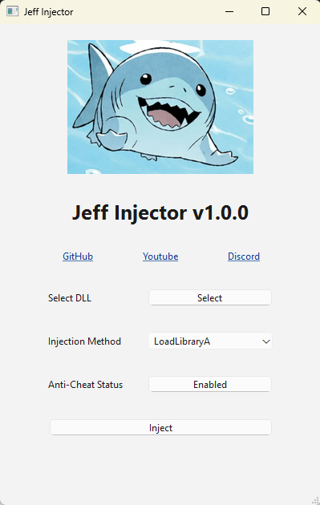

# Jeff Injector
A simple DLL injector and anti-cheat disabler for Marvel Rivals made entirely in Python.

*Tutorial video coming soon™*

## Features
- Ability to select a dll for injection and inject it
- Ability to select an injection method
    - *For now it only supports LoadLibraryA*
- Ability to disable the Anti-Cheat for Marvel Rivals

# Important
Every game update a few dll's get added to the game files that can cause GPU crashes for some users when using internal hacks. Search and delete/rename [these dll's](https://www.unknowncheats.me/forum/marvel-rivals/691694-reminder-game-updates.html) in your game files.

Also, make sure you have this command in your launch options:
`cmd /min /C "set __COMPAT_LAYER=RUNASINVOKER && start "" %command%"`

# How to Use
- [Youtube Video Guide](https://youtu.be/IzWPDmahlN4)

1. Refer to the build instructions or install/extract the latest release `.zip` file
2. Run `JeffInjector.exe` as administrator
3. Click the `Select` button and navigate to your DLL
4. Click the `Enabled` button beside `Anti-Cheat Status`. Once this button says `Disabled` the anti-cheat has been disabled.
5. Press the `Inject` button to inject your dll

# Building Source
1. Clone the repository
2. Create a Python environment and activate it
3. Install the requirements via `pip install -r requirements.txt`
4. Install the extra dependency of pyMeow via `pip install lib/pyMeow-1.73.42.zip`
    - This zip file is already included in the repo under the `lib` folder
5. You can now run the project with `python main.py` or build the exe into the `dist` folder with the command:
    - `pyinstaller --onefile --icon=resources/JEFF.ico --name "JeffInjector" --windowed main.py`

# The \tools Folder
1. `build.bat` - Builds Jeff and opens the folder with the exe
2. `RandomizeMAC.ps1` - Changes your MAC Adress, used by MR to Ban Accounts
3. `removeDLLs.bat` - Removes the unwanted dlls from the MR Steam install * Jeff will do this if opened before MR